# 🚀 Proj1_LocalLLMTestCaseGenerator

A local AI-powered test case generator that uses **Ollama** and **Llama 3.2** to automatically create comprehensive test cases from natural language requirements.


---

## ✨ Features

- 🤖 **AI-Powered**: Uses Llama 3.2 (3B) running locally via Ollama
- 🔒 **Privacy-First**: All processing happens on your machine - no data leaves your computer
- 💬 **Chat Interface**: Modern, dark-mode UI for intuitive interaction
- 📝 **Markdown Output**: Test cases rendered in clean, formatted Markdown
- ⚡ **Real-time**: Instant test case generation with typing indicators

---

## 🏗️ Architecture

```mermaid
graph TD
    classDef browser fill:#f9f9f9,stroke:#333,stroke-width:2px;
    classDef server fill:#e1f5fe,stroke:#0277bd,stroke-width:2px;
    classDef ai fill:#f3e5f5,stroke:#7b1fa2,stroke-width:2px;

    subgraph UserSpace ["🌐 User Space"]
        Browser["💻 Browser (React UI)"]:::browser
    end

    subgraph Backend ["⚙️ Backend Server"]
        Flask["🔥 Flask API\n(Port 3000)"]:::server
        PromptEng["📝 Prompt Engine"]:::server
    end

    subgraph LocalAI ["🦙 Local AI Cluster"]
        Ollama["🧠 Ollama Runtime\n(Port 11434)"]:::ai
        Llama["💿 Llama 3.2 Model"]:::ai
    end

    Browser <-->|"HTTP POST /generate"| Flask
    Flask -->|Build Prompt| PromptEng
    PromptEng -->|Structured Context| Flask
    Flask <-->|Generate Request| Ollama
    Ollama <-->|Inference| Llama
```



### Flow Diagram


---

## 📁 Project Structure

```
Proj1_LocalLLMTestCaseGenerator/
├── app.py                    # Flask backend server
├── tools/
│   ├── ollama_client.py      # Ollama API wrapper
│   └── prompt_engine.py      # Prompt template builder
├── templates/
│   └── index.html            # Chat UI template
├── static/
│   ├── css/
│   │   └── styles.css        # Dark mode styling
│   └── js/
│       └── script.js         # Frontend logic
├── architecture/
│   └── sops.md               # System SOPs
├── task_plan.md              # Project task tracker
├── progress.md               # Development log
├── findings.md               # Research & discoveries
├── gemini.md                 # Data schemas & rules
├── B.L.A.S.T.md              # Development protocol
└── .gitignore
```

---

## 🛠️ Prerequisites

1. **Python 3.9+**
2. **Ollama** installed and running
   ```bash
   # Install Ollama (macOS)
   brew install ollama
   
   # Or download from https://ollama.ai
   ```

3. **Llama 3.2 model**
   ```bash
   ollama pull llama3.2
   ```

---

## 🚀 Installation

1. **Clone the repository**
   ```bash
   git clone https://github.com/roshrv27/Proj1_LocalLLMTestCaseGenerator.git
   cd Proj1_LocalLLMTestCaseGenerator
   ```

2. **Install dependencies**
   ```bash
   pip install flask ollama
   ```

3. **Start Ollama** (in a separate terminal)
   ```bash
   ollama serve
   ```

4. **Run the application**
   ```bash
   python3 app.py
   ```

5. **Open your browser**
   ```
   http://localhost:8080
   ```

---

## 💡 Usage

1. Open the web interface at `http://localhost:8080`
2. Type your feature requirements in natural language:
   ```
   Login page with email and password fields, 
   forgot password link, and remember me checkbox
   ```
3. Press Enter or click Send
4. Receive structured test cases including:
   - Test Case ID
   - Description
   - Pre-conditions
   - Test Steps
   - Expected Results
   - Positive & Negative scenarios

---

## 🎨 Screenshots

### Chat Interface
The modern dark-mode interface provides a clean, distraction-free environment for generating test cases.

### Sample Output
```markdown
## TC_001: Verify successful login with valid credentials
**Pre-conditions:** User account exists
**Steps:**
1. Navigate to login page
2. Enter valid email
3. Enter valid password
4. Click Login button
**Expected Result:** User is redirected to dashboard
```

---

## 🔧 Configuration

| Setting | Location | Default |
|---------|----------|---------|
| Port | `app.py` | 8080 |
| Model | `tools/ollama_client.py` | llama3.2 |
| Host | `app.py` | 0.0.0.0 |

---

## 📄 License

MIT License - feel free to use this project for personal or commercial purposes.

---

## 🙏 Acknowledgments

- [Ollama](https://ollama.ai) - Local LLM runtime
- [Meta Llama](https://llama.meta.com) - Llama 3.2 model
- [Flask](https://flask.palletsprojects.com) - Python web framework
- [Marked.js](https://marked.js.org) - Markdown parser

---

## 🤝 Contributing

Contributions are welcome! Please feel free to submit a Pull Request.

---

**Built with ❤️ using the B.L.A.S.T. Protocol**
